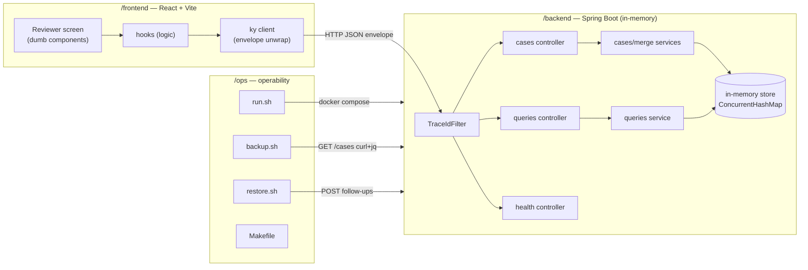
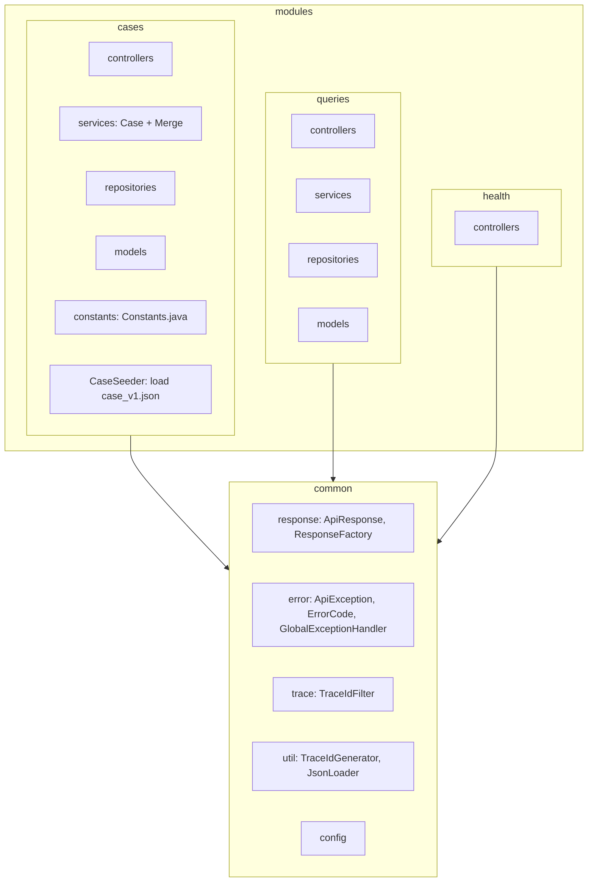
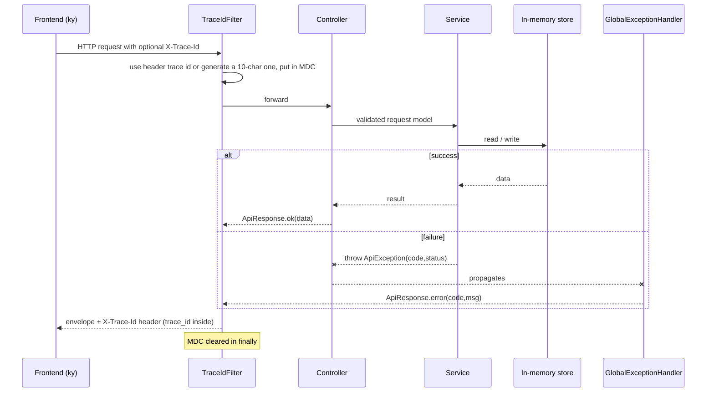
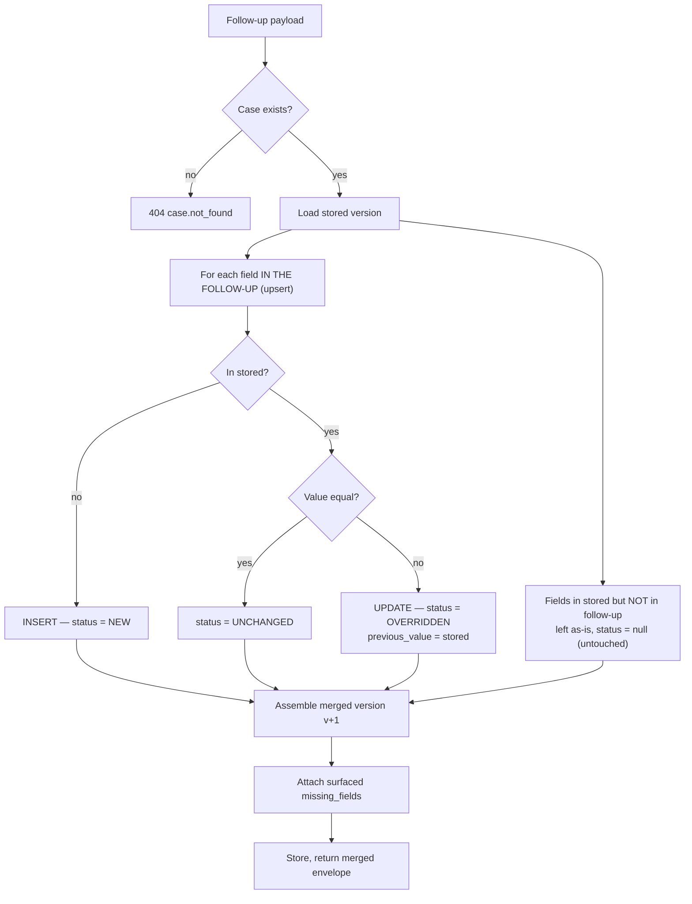
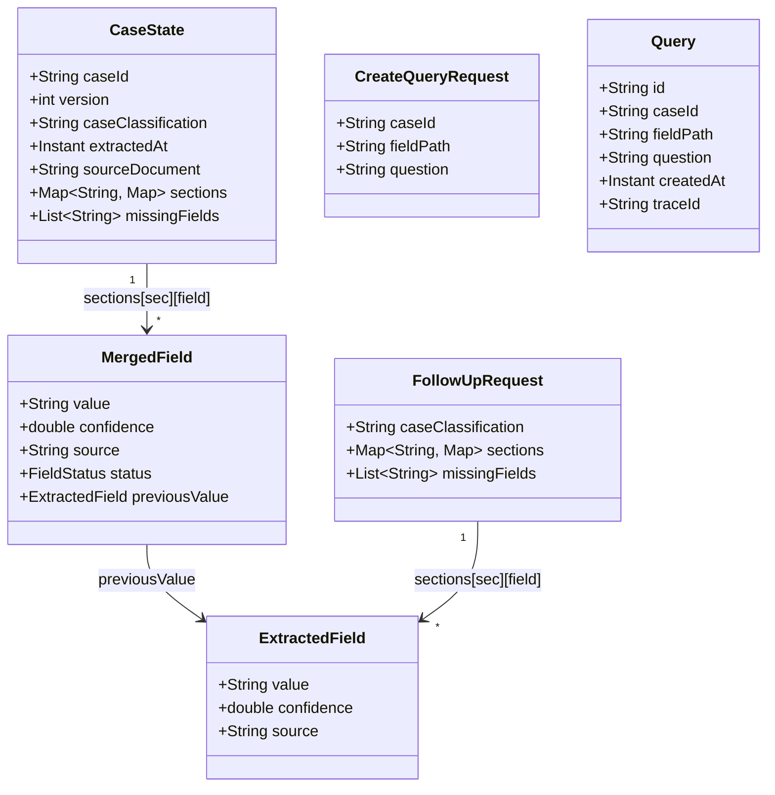
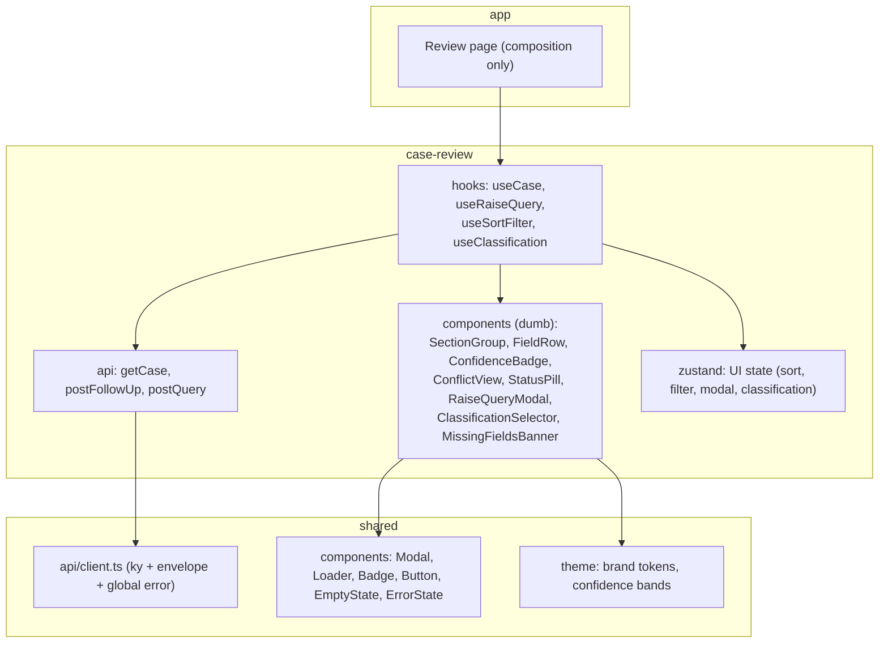
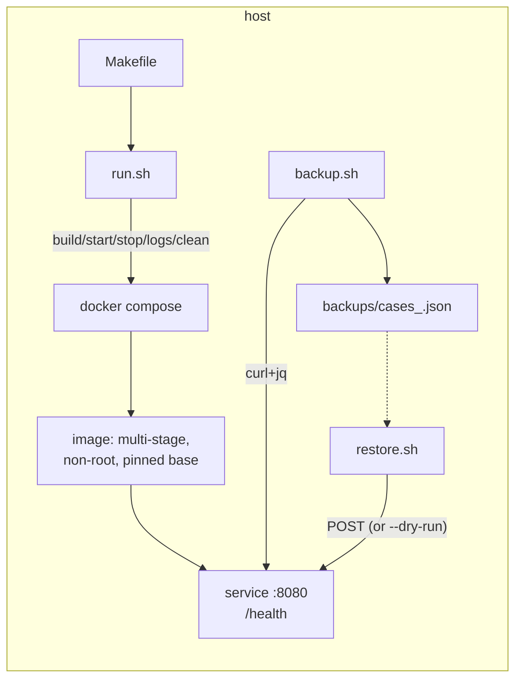

# Architecture

The system design and module map for this assignment. Read after `docs/conventions.md`. Diagrams are Mermaid.

---

## 1. System overview

Three deliverables, one repo. The frontend talks only to the backend's HTTP API; ops tooling drives and backs up the running service.



---

## 2. Backend — vertical slices

Each feature is a self-contained module. Cross-cutting concerns live in `common/`.



**Dependency rule:** controller → its own service → its own repository → `common/`. No module reaches into another module's controller or repository.

---

## 3. Request lifecycle (trace ID flow)

Every request is wrapped by `TraceIdFilter`, which seeds the `trace_id` into MDC so every log line and the response envelope carry it.



---

## 4. The merge — "the meaningful part"

`POST /cases/{caseId}/follow-ups` **upserts** the follow-up onto the stored version, field by field — update an existing field, insert a new one — and returns the merged case with a per-field `status` and the surfaced `missing_fields`.



### 4.1 Field statuses

| Status | Condition | Action / carries |
|---|---|---|
| `new` | Field not in stored version | **insert**; value |
| `overridden` | Field in both, value differs | **update**; value + `previous_value` |
| `unchanged` | Field in both, value identical | value (brief-mandated) |
| `null` | Field in stored, **absent from this follow-up** | left untouched; value, no annotation |

### 4.2 The judgment call (the brief's "your call")

**"Field in stored version but not in follow-up: your call. Document your reasoning."**

**Decision:** leave the field untouched with `status: null`. A follow-up only carries the fields it has information about; a field's absence means *"this follow-up says nothing about it,"* not *"delete it"* and not *"a deliberate carry-over action happened."*

`null` is the honest signal: it distinguishes a field the follow-up never mentioned (`null`) from one the follow-up re-sent unchanged (`unchanged`). Inventing a synthetic status like `retained` would imply an action the system didn't take. This still honors no-silent-fallback — nothing is dropped, the original value stays, and the absence of a status *is* the information.

### 4.3 Merged response shape (envelope `data`)

```json
{
  "case_id": "PV-2026-0451",
  "version": 2,
  "case_classification": "non-significant",
  "sections": {
    "patient": {
      "weight_kg": {
        "value": "80", "confidence": 0.9, "source": "p.3 §2",
        "status": "overridden",
        "previous_value": { "value": "78", "confidence": 0.85, "source": "p.3 §2" }
      },
      "age": { "value": "62", "confidence": 0.91, "source": "p.2 §1", "status": "unchanged" },
      "sex": { "value": "Male", "confidence": 0.99, "source": "p.2 §1", "status": null }
    },
    "adverse_event": {
      "recovery_date": { "value": "2026-04-01", "confidence": 0.88, "source": "p.5 §2", "status": "new" }
    }
  },
  "missing_fields": ["adverse_event.causality_assessment"]
}
```

- `status: "overridden"` → updated, carries `previous_value`.
- `status: "unchanged"` → follow-up re-sent the same value.
- `status: null` → field was never in this follow-up (untouched).
- `status: "new"` → field inserted by the follow-up.
- `missing_fields` → surfaced verbatim from the follow-up payload (brief requirement: fields the AI couldn't extract).

---

## 5. Data model



### 5.1 The three leaf/aggregate kinds, and why

| Type | Role | Shape |
|---|---|---|
| `ExtractedField` | **Raw leaf** the AI produced. Used both for inbound follow-up fields and as the `previousValue` snapshot. | `value, confidence, source` |
| `MergedField` | **Stored/returned leaf.** A reviewed field = raw leaf + diff annotation. | `ExtractedField` fields + nullable `status` + nullable `previousValue` |
| `CaseState` | **Stored aggregate.** The current merged case. | header fields + `sections` + `missingFields` |

### 5.2 Modeling decisions (the reasoning you asked for)

1. **Sections are `Map<String, Map<String, …>>`, not typed POJOs** (no `PatientSection` class). The data is AI-extracted and the brief explicitly supports **new fields not in the stored version**. A rigid typed schema would *reject* a brand-new field — the opposite of what we must do. Generic ordered maps (`LinkedHashMap`) accept any new section/field and preserve order for the UI. Trade-off: we lose compile-time field names, so validation is **structural** (every leaf must have `value`/`confidence`/`source`), not field-name-based. For AI-extracted, evolving data this is the correct trade — and it's the kind of judgment the brief is probing.

2. **One stored shape; `GET` and `POST /follow-ups` return the same thing.** Storage holds `CaseState` with `MergedField` leaves. On bootstrap, `case_v1.json` parses into `MergedField`s with `status = null` (nothing merged yet). A follow-up upserts and sets statuses. So `GET /cases/{id}` returns the merged representation too — which is exactly what the Phase 2 screen needs to render conflicts on load. **Full-stack coherence:** the frontend has one shape to handle, not two.

3. **No version history kept.** We store only the *current* merged `CaseState` plus a `version` counter that increments per follow-up. `previous_value` is the value immediately before this follow-up, which is the current stored value at merge time — so we never need older versions. Keeping a full history would be unused complexity (KISS / "don't over-engineer").

4. **Request DTOs are separate from the stored model, response is the stored model.**
   - **Inbound:** `FollowUpRequest` and `CreateQueryRequest` are dedicated DTOs — they're the validated boundary (Jakarta `@NotBlank` on query fields; structural checks on follow-up leaves). `FollowUpRequest` carries `ExtractedField` leaves (no status — the *caller* doesn't set status; the *merge* derives it). This stops a client from spoofing `status`/`previous_value`.
   - **Outbound:** `CaseState` (with `MergedField`s) *is* the response payload, wrapped in `ApiResponse<T>`. We don't maintain a parallel "response DTO" that duplicates every field — that would be DRY-violating boilerplate for zero benefit at this size.

5. **Lombok + builders, immutable where natural.** `@Value @Builder` on `ExtractedField`/`MergedField`/`Query`/DTOs; the merge produces a rebuilt `CaseState` rather than mutating in place. `@Data` only where mutation genuinely simplifies.

6. **Wire ↔ Java naming.** JSON is snake_case (`case_id`, `previous_value`, `missing_fields`); Java is camelCase. Set Jackson's `SNAKE_CASE` strategy **once** globally in `common/config` — no per-field `@JsonProperty` scattered around (DRY).

### 5.3 Storage & field paths

- **Storage:** `CaseRepository` holds `Map<caseId, CaseState>` (current merged case). `QueryRepository` holds `Map<caseId, List<Query>>`. Both `ConcurrentHashMap`-backed.
- **`fieldPath`** for a query is `"<section>.<field>"`, e.g. `patient.weight_kg`. Validated against the current case; unknown path → `validation.invalid_field_path`.

---

## 6. Endpoints

| # | Method & path | Purpose | Success data | Error codes |
|---|---|---|---|---|
| 1 | `GET /cases/{caseId}` | Latest version | `Case` | `case.not_found` |
| 2 | `POST /cases/{caseId}/follow-ups` | Merge follow-up | merged response (§4.3) | `case.not_found`, `case.invalid_follow_up`, `validation.*` |
| 3 | `POST /queries` | Raise a query | created `Query` | `query.case_not_found`, `validation.invalid_field_path`, `validation.missing_field` |
| 4 | `GET /queries?caseId={id}` | List queries | `Query[]` | `validation.missing_field` |
| 5 | `GET /health` | Liveness | `{status:"UP"}` | — |

All wrapped in the standard envelope (`conventions.md §4`).

---

## 7. Frontend — vertical slice (`case-review`)



- **Data flow:** page → hook → ky client → backend. Components receive props + callbacks from hooks only.
- **Confidence bands (enum + theme tokens):** low `< 0.80`, medium `0.80–0.90`, high `> 0.90`.
- **Conflict view:** `overridden` fields render new value primary, `previous_value` secondary, side-by-side; a "Raise Query" button opens the shared `Modal`.
- **Backend-down fallback** (the *one* sanctioned fallback, per the brief): import the JSON directly and **flag it visibly** in the UI as a known degraded mode. This is the brief's explicit instruction, so it is allowed — and it is surfaced, not silent.

---

## 8. Ops architecture



- **Dockerfile:** multi-stage (Gradle build → slim JRE runtime), pinned base image digests/tags, non-root user, only the jar in the final layer.
- **compose:** one service, `healthcheck` hitting `/health`. No external deps introduced, so none added.
- **run.sh:** `build|start|stop|test|logs|clean`, `--help`, proper exit codes, fails gracefully if Docker isn't running.
- **backup.sh:** cron-safe, no prompts, logs to stderr with timestamps, non-zero on failure.
- **restore.sh:** `--dry-run`, idempotent re-POST.

Detailed runbook lives in the backend/ops README's "Operations" section.

---

## 9. Build order (planned)

1. **Docs** (this set) → review.
2. **Backend scaffold** from Spring Initializr (Gradle), wire `common/` (envelope, error handler, trace filter).
3. **`cases` module** — models, repository, bootstrap load, `GET /cases`, then merge + `POST /follow-ups` with tests (merge edge cases).
4. **`queries` module** — `POST /queries`, `GET /queries`.
5. **`health`** + README with 4 curl examples.
6. **Ops** — Dockerfile, compose, scripts, Makefile, runbook.
7. **Frontend** (live) — theme → shared primitives → `case-review` module.

Each step: implement → review → update `context.md` + `CHANGELOG.md` → commit.
